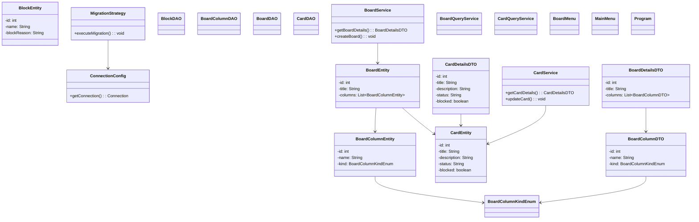

# Board de Tarefas

Este projeto é uma aplicação para gerenciar um **board de tarefas**. Ele organiza tarefas em colunas, permitindo ao usuário criar, mover e concluir tarefas de maneira intuitiva.

## Funcionalidades

- **Gerenciamento de Tarefas**: Criação, edição, exclusão e movimentação de tarefas entre colunas.
- **Personalização de Board**: Criação de colunas personalizadas para diferentes fases do fluxo de trabalho.
- **Sistema de Bloqueio e Finalização**: Controle de tarefas bloqueadas ou concluídas.
- **Persistência de Dados**: Uso de banco de dados para armazenar boards e tarefas.
- **Migrações com Liquibase**: Gerenciamento da estrutura do banco de dados de forma controlada.
- **Interface Simples**: Menus interativos para criar e gerenciar boards e tarefas.

## Requisitos

- **Java**: Versão 17 ou superior.
- **Gradle**: Para gerenciar dependências e build do projeto.
- **Banco de Dados**: Requer um banco de dados configurado (ex.: PostgreSQL, MySQL, etc.).
- **Liquibase**: Para aplicar migrações no banco de dados.

## Estrutura do Projeto

Abaixo está a estrutura do projeto representada como um diagrama:



## Como Executar o Projeto

1. **Clonar o Repositório**
   ```bash
   git clone https://github.com/rodrigobarr0s/board-tarefas.git
   cd board-tarefas
   ```

2. **Configurar o Banco de Dados**
    - Configure as credenciais do banco de dados no arquivo `ConnectionConfig.java`.
    - Certifique-se de que o banco de dados esteja rodando.

3. **Executar as Migrações**
    - Certifique-se de que o Liquibase está configurado corretamente.
    - Execute as migrações usando a classe `MigrationStrategy`.

4. **Compilar e Rodar o Projeto**
   ```bash
   gradle build
   java -jar build/libs/board-tarefas.jar
   ```

5. **Interagir com o Sistema**
    - Após iniciar o sistema, utilize os menus interativos para criar e gerenciar boards e tarefas.

## Dependências Importantes

- **Liquibase**: Gerenciamento de migrações de banco de dados.
- **Lombok**: Redução da verbosidade do código.
- **Driver JDBC**: Para conectar ao banco de dados configurado.

## Contribuição

Contribuições são bem-vindas! Siga os passos abaixo para contribuir:

1. Faça um fork do projeto.
2. Crie uma branch para a sua feature ou correção.
   ```bash
   git checkout -b feature/nome-da-sua-feature
   ```
3. Faça commit das suas alterações.
   ```bash
   git commit -m "Descrição da sua alteração"
   ```
4. Envie a branch para o seu fork.
   ```bash
   git push origin feature/nome-da-sua-feature
   ```
5. Abra um Pull Request explicando as alterações propostas.

## Licença

Este projeto está licenciado sob a [MIT License](https://github.com/rodrigobarr0s/board-tarefas/blob/main/LICENSE).

## Autor

Desenvolvido por Rodrigo Barros. Entre em contato para dúvidas ou sugestões!